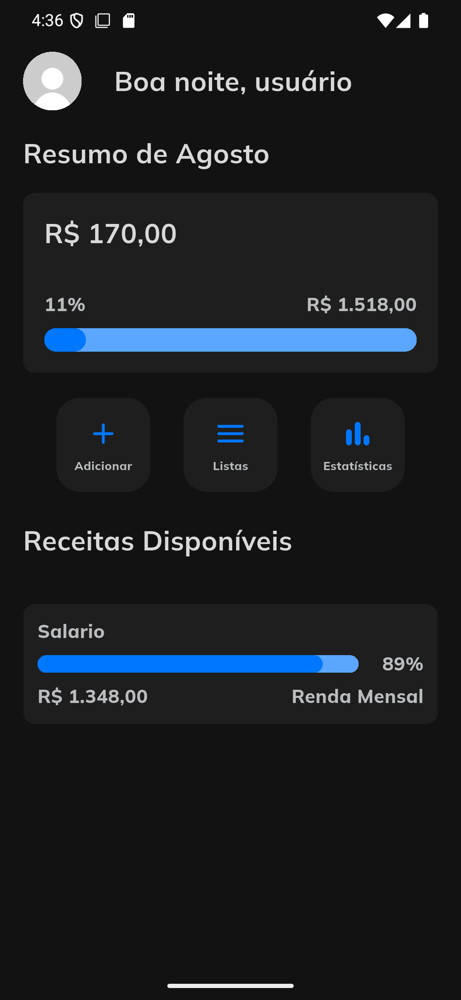
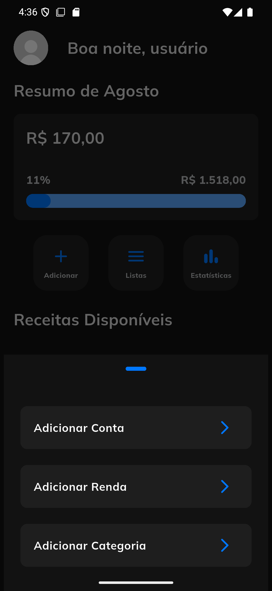
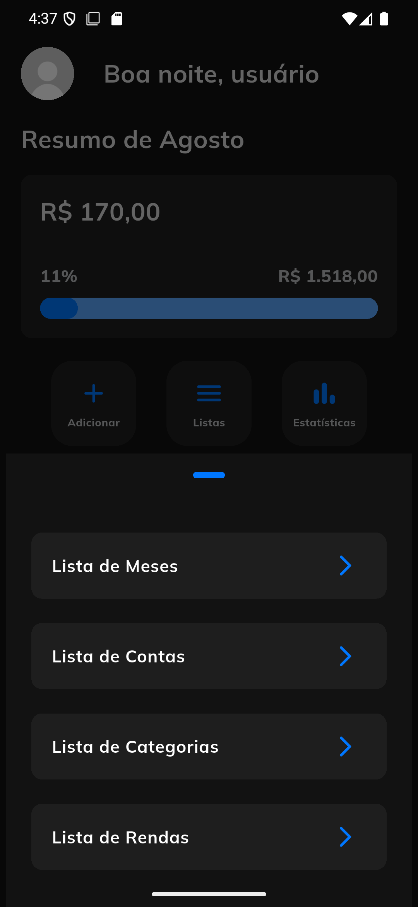
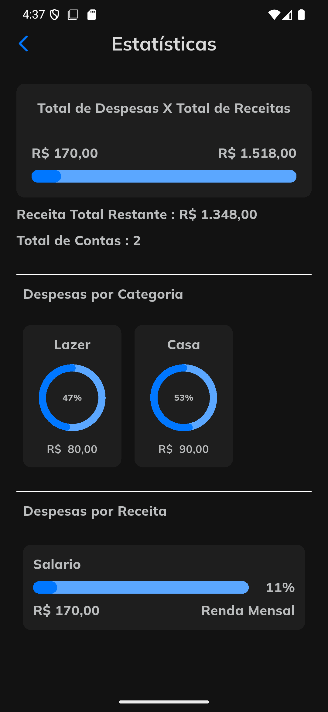
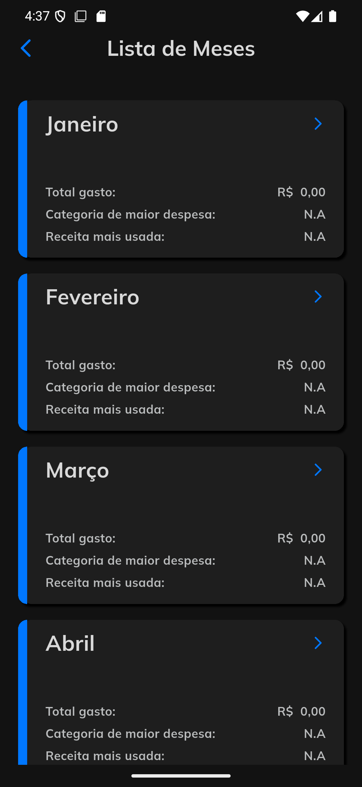
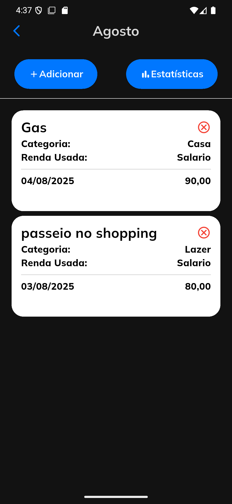
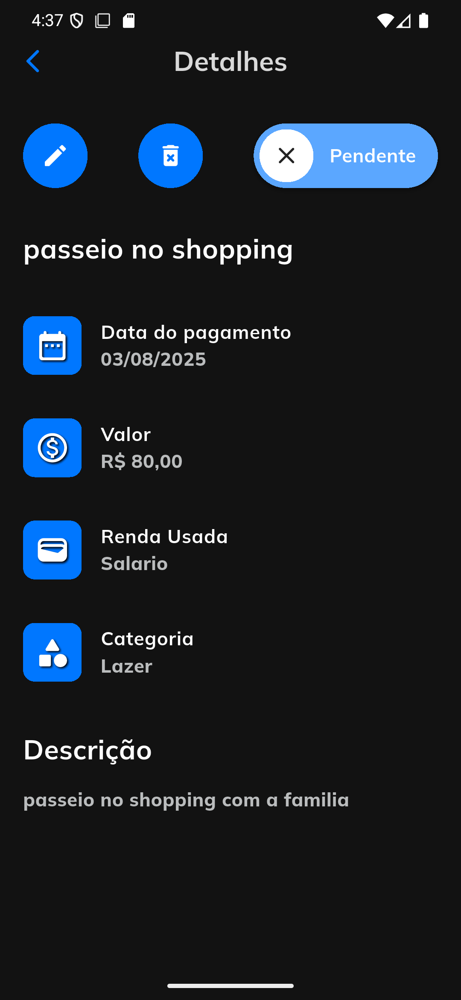
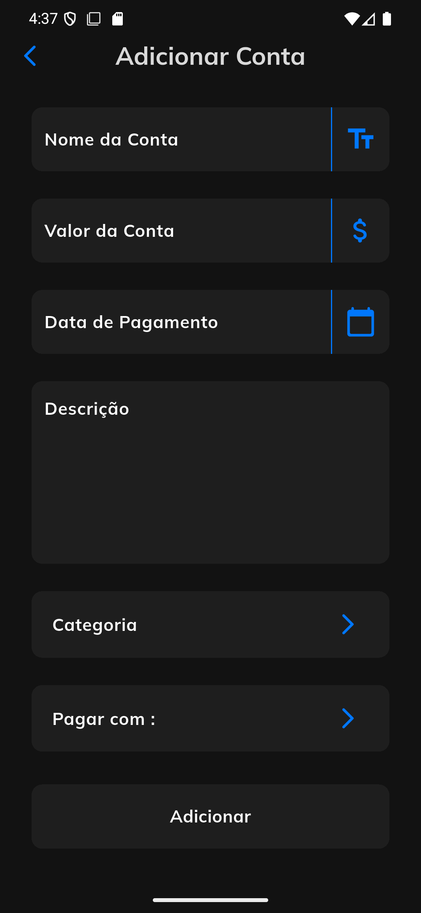
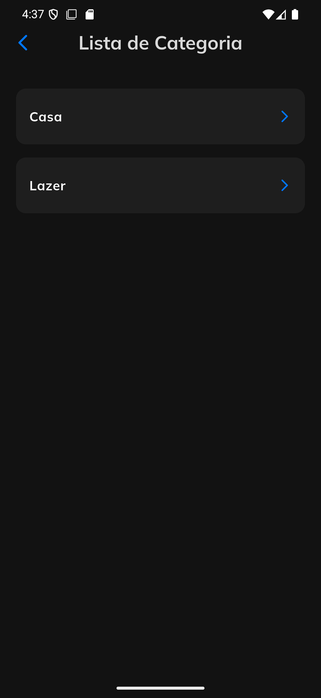
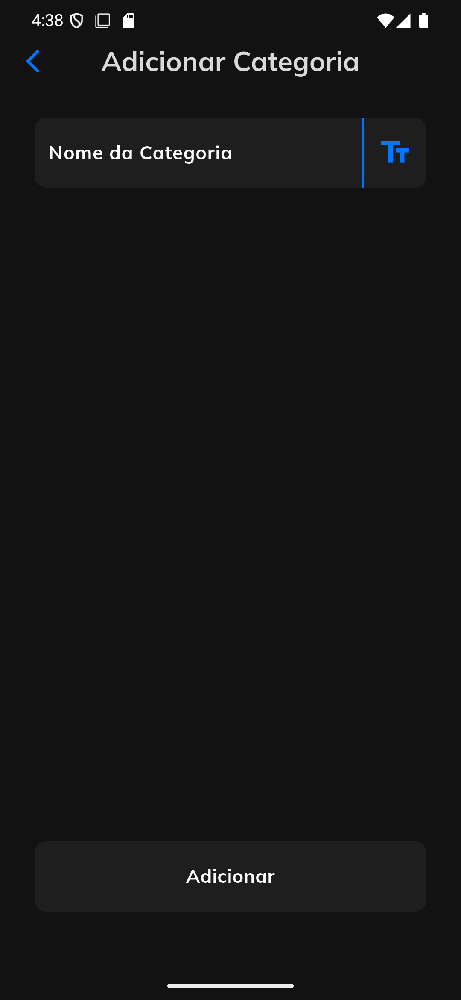

# 💰 App de Controle Financeiro

Um aplicativo completo de **gestão financeira pessoal**, focado em organização de gastos mensais, controle por categoria e análise do uso da sua receita. Desenvolvido em **Flutter**, o app oferece uma experiência prática e intuitiva para acompanhar sua vida financeira com clareza.

## 🚀 Funcionalidades

- ✅ Cadastro, edição e remoção de **gastos**
- 📆 Organização de despesas por **mês**
- 📊 Visualização gráfica de **gastos por categoria**
- 🧾 Registro de **categorias personalizadas**
- 💼 Gerenciamento de **fontes de receita**
- 🔄 Associação de despesas a fontes específicas de pagamento
- 📈 Barra de progresso que mostra quanto da sua receita já foi utilizada

## 📸 Imagens (exemplos)

> ### Tela inicial
  

> ### Tela de Estatísticas

> ### Tela de Lista de Meses

> ### Tela de Contas

> ### Tela Detalhes da Conta

> ### Tela de Adicionar Conta
  

> ### Tela de Adicionar Categoria

> ### Tela de Adicionar Receita
 

## 🛠️ Tecnologias Utilizadas

- **Flutter** com Dart
- **GetIt** para injeção de dependência
- **flutter_bloc** para gerenciamento de estado
- **SQLite** via `sqflite`
- **fl_chart** para gráficos de pizza e barra
- **Shared Preferences** para dados simples

## 📌 Observações
O foco do app é no controle real de gastos, e não em simulações.

Você pode criar categorias e fontes de receita personalizadas para se adaptar à sua realidade.

O sistema de progressão de uso da receita ajuda a visualizar quanto da sua receita já foi utilizada no mês.

📄 Licença
Este projeto está licenciado sob a MIT License.
