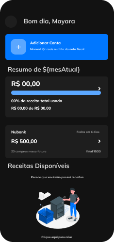
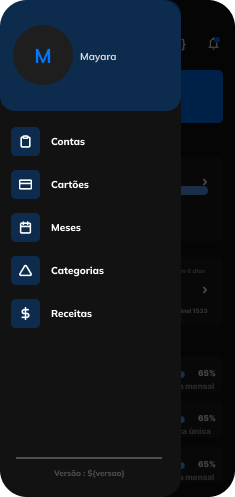
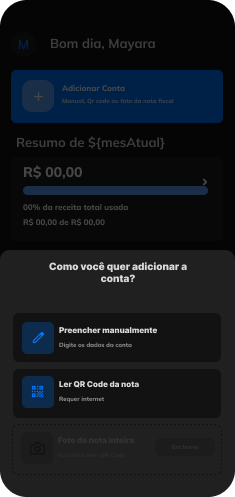
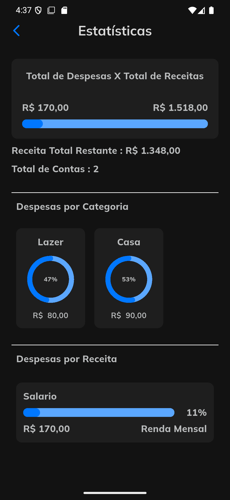
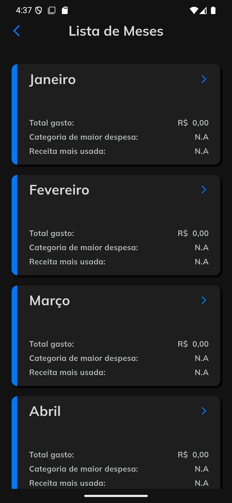
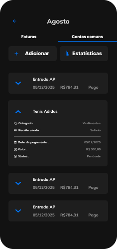
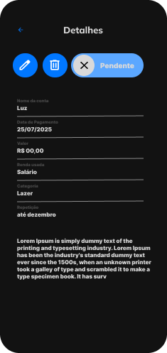

# 💰 Fluxx

Um aplicativo completo de **gestão financeira pessoal**, focado em organização de gastos mensais, controle por categoria, cartões de crédito e análise do uso da sua receita. Desenvolvido em **Flutter**, o app oferece uma experiência prática e intuitiva para acompanhar sua vida financeira com clareza, com todos os dados salvos localmente no dispositivo.

## 🚀 Funcionalidades

- ✅ Cadastro, edição e remoção de **gastos** (contas comuns)
- 🔁 Repetição de contas por vários meses (parceladas ou recorrentes)
- 📆 Organização de despesas e receitas por **mês** e **ano**
- 📊 Visualização de **gastos por categoria** e uso de cada receita
- 🧾 Registro de **categorias personalizadas**, mensais ou únicas
- 💼 Gerenciamento de **fontes de receita**, mensais ou únicas
- 🔄 Associação de despesas a fontes específicas de pagamento
- 💳 Cadastro de **cartões de crédito**, com cálculo automático do ciclo de fatura por dia de fechamento
- 🛍️ Compras no cartão à vista ou parceladas, com lançamento automático na fatura correta de cada mês
- 💵 Pagamento de fatura vinculado a uma receita disponível
- 📈 Barra de progresso que mostra quanto da sua receita já foi utilizada, e o limite recomendado de uso do cartão

## 📸 Imagens (exemplos)

> ### Tela inicial
  

> ### Tela de Estatísticas

> ### Tela de Lista de Meses

> ### Tela de Contas

> ### Tela Detalhes da Conta

## 🛠️ Tecnologias Utilizadas

- **Flutter** com Dart
- **flutter_bloc** (Cubit) para gerenciamento de estado
- **get_it** para injeção de dependência
- **sqflite** (SQLite) para persistência local
- **intl** para formatação de datas e valores (locale pt_BR)
- **animated_toggle_switch**, **flashy_flushbar**, **loading_animation_widget**, **percent_indicator** para componentes de interface
- **flutter_masked_text2** para máscaras de valores monetários
- **image_picker** para foto de perfil
- **uuid** para geração de identificadores

## 📌 Observações

O foco do app é no controle real de gastos, e não em simulações.

Você pode criar categorias e fontes de receita personalizadas para se adaptar à sua realidade.

O sistema de progressão de uso da receita ajuda a visualizar quanto da sua receita já foi utilizada no mês, tanto em contas comuns quanto em faturas de cartão de crédito.

Todos os dados ficam armazenados localmente no dispositivo — não há sincronização em nuvem nem backend.

📄 Licença
Este projeto está licenciado sob a MIT License.
